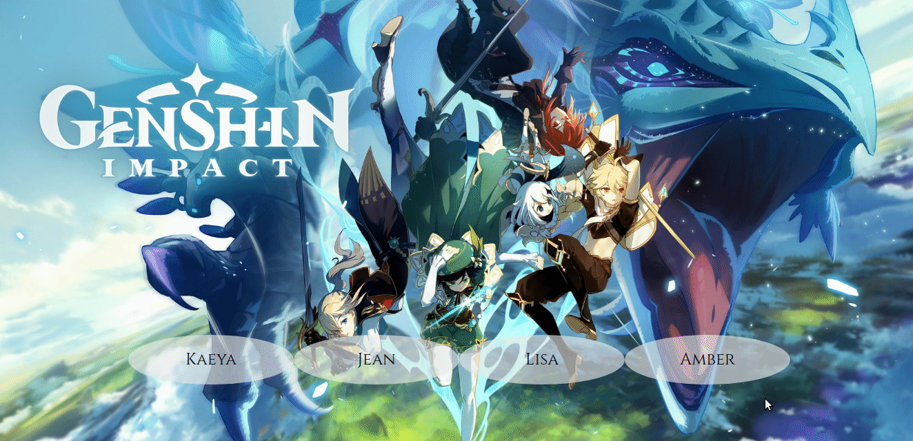
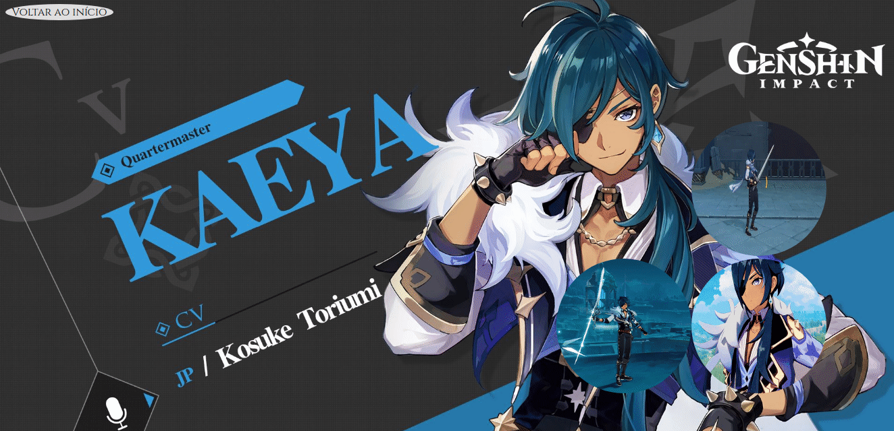
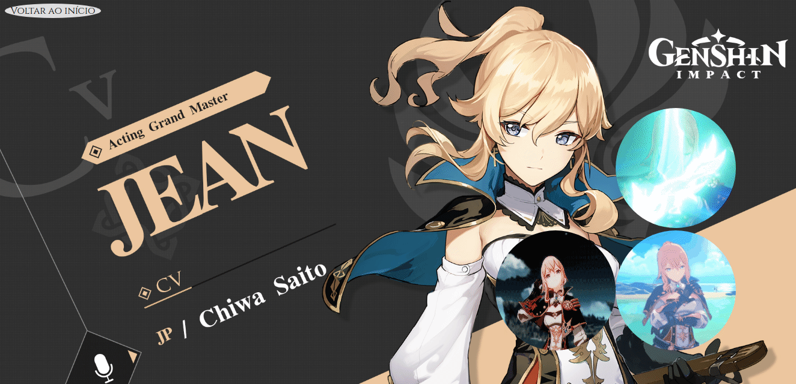
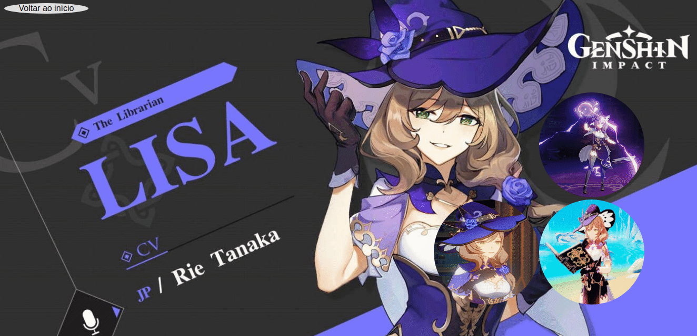
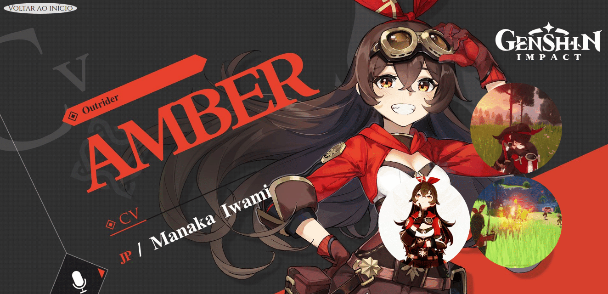

# Genshin Impact SSR
'Genshin Impact SSR' é uma aplicação em Next.js para o exercício de Side Server Rendering (SSR)    

 
  

## Índice
* [Sobre o projeto](#sobre-o-projeto)
* [Tech](#tecnologias)
* [Screenshots](#screenshots)

## Sobre o projeto
A aplicação tem como objetivo a prática de SSR para o projeto de React Back Avançado da Recode Pro 

	
## Tecnologias
Atualmente rodando com:

- [x] React
- [x] Next.js

## Screenshots

 
 

	
